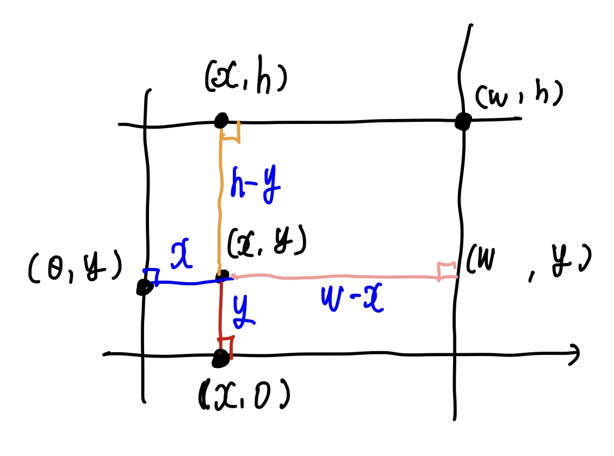

# \[BOJ 01085\] 직사각형에서 탈출

- 난이도 : Bronze3
- 기본적인 기하 지식이 필요
- 문제: <a href="https://www.acmicpc.net/problem/1085" target="_blank"> [링크]</a>

---

## 풀이


- 직사각형 영역 안의 한 점에서, 각 변에 도달 할 수 있는 최단 거리들은 각 변에 내린 수선의 길이이다.
- 모든 수선의 길이를 구한 뒤, 이들을 비교하여 최솟값을 반환하면 된다.

### 코드
```java
public static void main(String[] args) throws IOException {
    int x = readInt();
    int y = readInt();
    int w = readInt();
    int h = readInt();

    int min = Math.min(Math.min(Math.min(x, y), h - y), w - x);
    System.out.print(min);
}
```

---
