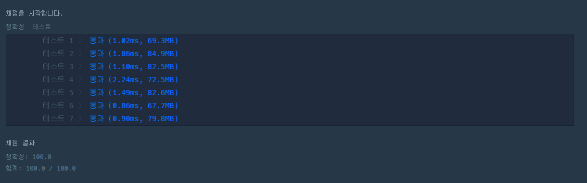

# 문제
- 번호 : 120880
- 제목 : 특이한 정렬
- 난이도 : Level 0
- 정수가 담긴 배열 numlist와 정수 n이 주어질 때 numlist의 원소를 n으로부터 가까운 순서대로 정렬한 배열을 return
- 문제 : [링크](https://school.programmers.co.kr/learn/courses/30/lessons/120880)

---

# 필요 알고리즘
- 정렬

---

# Java

## 풀이1 : 별도의 클래스 정의, Comparable, Stream 사용
```java

public class Solution1 {

    public int[] solution(int[] numlist, int n) {
        MyNumber.standard = n;

        return Arrays.stream(numlist)
                .mapToObj(MyNumber::new)
                .sorted()
                .mapToInt(MyNumber::getValue)
                .toArray();
    }

}

class MyNumber implements Comparable<MyNumber> {
    static int standard;

    int value;

    public MyNumber(int value) {
        this.value = value;
    }

    @Override
    public int compareTo(MyNumber o) {
        int thisDiff = this.diff();
        int otherDiff = o.diff();

        if (thisDiff == otherDiff) {
            return o.value - this.value;
        }
        return thisDiff - otherDiff;
    }

    private int diff() {
        return Math.abs(value - standard);
    }

    public int getValue() {
        return value;
    }
}
```
- MyNumber를 정의, Comparable을 구현한다.
- 

## 풀이2 : 스트림 없이, Comparator 구현
```java
import java.util.ArrayList;
import java.util.Comparator;
import java.util.List;

public class Solution2 {

    public int[] solution(int[] numlist, int n) {
        List<Integer> numbers = new ArrayList<>();

        for (int i : numlist) {
            numbers.add(i);
        }

        numbers.sort(myComparator(n));

        int[] answer = new int[numbers.size()];

        for (int i=0; i<numbers.size(); i++) {
            answer[i] = numbers.get(i);
        }
        return answer;
    }

    private Comparator<Integer> myComparator(int n) {
        return (a, b) -> {
            int aDiff = Math.abs(a - n);
            int bDiff = Math.abs(b - n);

            if (aDiff == bDiff) {
                return b - a;
            }
            return aDiff - bDiff;
        };
    }

}
```
- 스트림 없이 작업을 수행했다.

---

# Python
```python
def solution(numlist, n):
    return sorted(numlist, key=lambda x: (abs(x - n), n - x))

```
- 단 한 줄로 가능하다.
- 와 진짜...

---

# 결과





- 파이썬이 제일 빠르다. 와 진짜...

---
