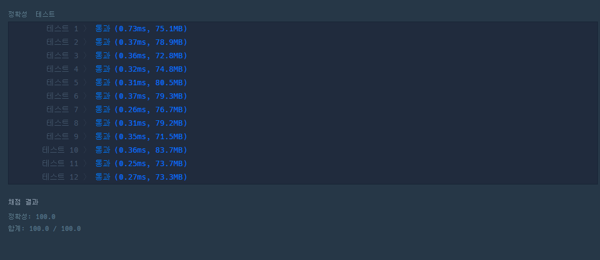

# 문제
- 번호 : 120882
- 제목 : 등수 매기기
- 난이도 : Level 0
- score가 주어질 때, 영어 점수와 수학 점수의 평균을 기준으로 매긴 등수를 담은 배열을 return
- 문제 : [링크](https://school.programmers.co.kr/learn/courses/30/lessons/120882)

---

# 필요 알고리즘
- 방문배열
- 정렬

---

# 풀이1 : 방문배열 활용
```java
public class Solution1 {

    public int[] solution(int[][] scores) {
        boolean[] checked = new boolean[scores.length];

        int[] sums = new int[scores.length];
        for (int i = 0; i < sums.length; i++) {
            sums[i] = (scores[i][0] + scores[i][1]);
        }

        int[] ranks = new int[scores.length];
        for (int i = 0; i < ranks.length; i++) {
            ranks[i] = 1;
        }

        int max;
        int sameCount;

        for (int i = 0; i < sums.length - 1; i++) {
            max = -1;
            sameCount = -1;

            for (int j = 0; j < sums.length; j++) {
                if (checked[j]) {
                    continue;
                }

                if (sums[j] > max) {
                    max = sums[j];
                    sameCount = 1;
                } else if (sums[j] == max) {
                    sameCount++;
                }
            }

            for (int j = 0; j < sums.length; j++) {
                if (checked[j]) {
                    continue;
                }

                if (sums[j] == max) {
                    checked[j] = true;
                } else {
                    ranks[j] += sameCount;
                }
            }
        }

        return ranks;
    }

}
```
- sums : 성적의 합계 저장
- ranks : 등수 저장
- checked : 최댓값 이력이 있으면 true (방문했다고 표현하겠다.)
- 반복 : (배열의 길이 -1)번
  - 방문처리 되지 않은 요소 중 최댓값을 찾고, 같은 등수의 사람의 갯수(sameCount)를 구한다.
  - 방문처리 되지 않은 요소를 다시 순회하면서 최댓값인 경우 방문처리하고, 최댓값이 아닌 것들의 등수를 sameCount만큼 증가시킨다.

---

# 풀이2 : 정렬 활용
```java
import java.util.ArrayList;
import java.util.Comparator;
import java.util.List;

public class Solution2 {

    public int[] solution(int[][] scores) {
        List<Integer> sums = new ArrayList<>();
        for (int i = 0; i< scores.length; i++) {
            sums.add(scores[i][0] + scores[i][1]);
        }
        sums.sort(Comparator.reverseOrder());

        int[] ranks = new int[scores.length];

        for (int i=0; i<ranks.length; i++) {
            ranks[i] = sums.indexOf(scores[i][0] + scores[i][1])+1;
        }

        return ranks;
    }

}
```
- 점수합을 sums에 담는다.(ArrayList)
- sums를 내림차순으로 정렬한다.
- indexOf 메서드를 사용하여 점수를 탐색하면 순서대로 앞부터 차례대로 접근하여 처음 만나는 지점의 인덱스를 반환한다.
이 인덱스에 1을 더한 값이 등수가 된다.
  - 동점자 처리 : 처음 만나는 지점의 인덱스를 반환받기 때문에 등수가 같음을 보장받을 수 있다.

---

## 결과




- 1번 코드는 길지만 속도가 더 빠르다.
- 코드 길이는 2번이 더 짧고 간결하지만 느리다.
  - 리스트로 박싱하는 작업을 수행해야하고 정렬을 해야한다.
- 이것은 트레이드 오프의 문제인 것 같다.
- 알고리즘 대회를 위한다면 첫번쨰 풀이가 더 적합하겠으나, 코딩 테스트를 위한다면 두번째 풀이가 더 좋지 않나 싶다. 

---
