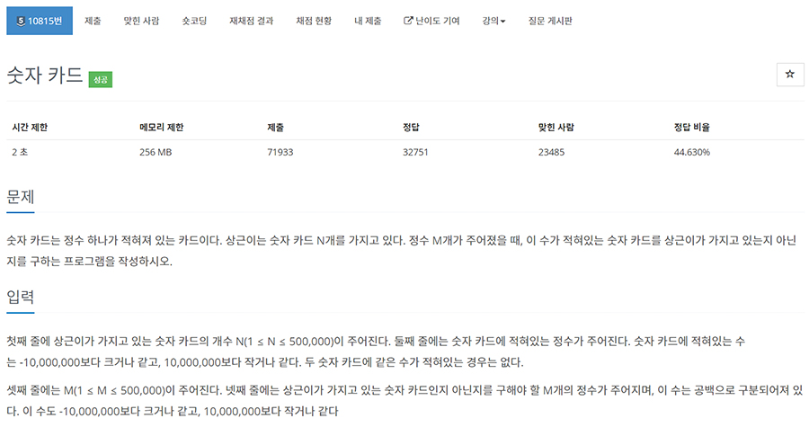

# 문제

- 플랫폼 : 백준
- 번호 : 10815
- 제목 : 숫자 카드
- 난이도 : Silver 5
- 첫째 줄에 입력으로 주어진 M개의 수에 대해서, 각 수가 적힌 숫자 카드를 상근이가 가지고 있으면 1을, 아니면 0을 공백으로 구분해 출력
- 문제 : <a href="https://www.acmicpc.net/problem/10815" target="_blank">링크</a>

---

# 필요 알고리즘
- 해시
- 이분탐색

---

# 풀이

## 풀이1 : 해시
```python
import io, os, sys

lines = io.BytesIO(os.read(0, os.fstat(0).st_size)).read().splitlines()
print = sys.stdout.write

a = set(n for n in lines[1].split())
print(' '.join('1' if x in a else '0' for x in lines[3].split()))
```
- set에 '상근이'가 가진 카드 목록을 모아둔다.
- 이후 각 요소마다 set에 포함되었는 지 여부에 따라 1 0을 순서대로 출력한다.
- 이 방식이 제일 빠르다.

## 풀이2: 이분 탐색
```python
import io, os, sys

lines = io.BytesIO(os.read(0, os.fstat(0).st_size)).read().splitlines()
print = sys.stdout.write

a = sorted(map(int, lines[1].split()))
b = list(map(int, lines[3].split()))

answer = []
for n in b:
    lt = 0
    rt = len(a) - 1
    flag = False
    while lt <= rt:
        mid = (lt + rt) // 2
        if a[mid] == n:
            flag = True
            break
        elif a[mid] > n:
            rt = mid - 1
        else:
            lt = mid + 1
    if flag:
        answer.append('1')
    else:
        answer.append('0')
print(' '.join(answer))
```
- '상근이'가 가진 카드 목록을 입력받고, 숫자로 변환하여 정렬한다.
- 각 요소마다 이분 탐색을 통해 존재 여부를 확인한다.

---

# 결과


- 해시를 사용한 방식이 압도적으로 빠르다.
- 해시는 매번 요소의 존재 여부를 O(1)로 확인할 수 있기 때문이다.
- 이분 탐색은 문자열을 숫자로 변경하고 정렬해야하며, 매번 요소의 존재 여부를 O(logN)으로 판단해야한다.

---
