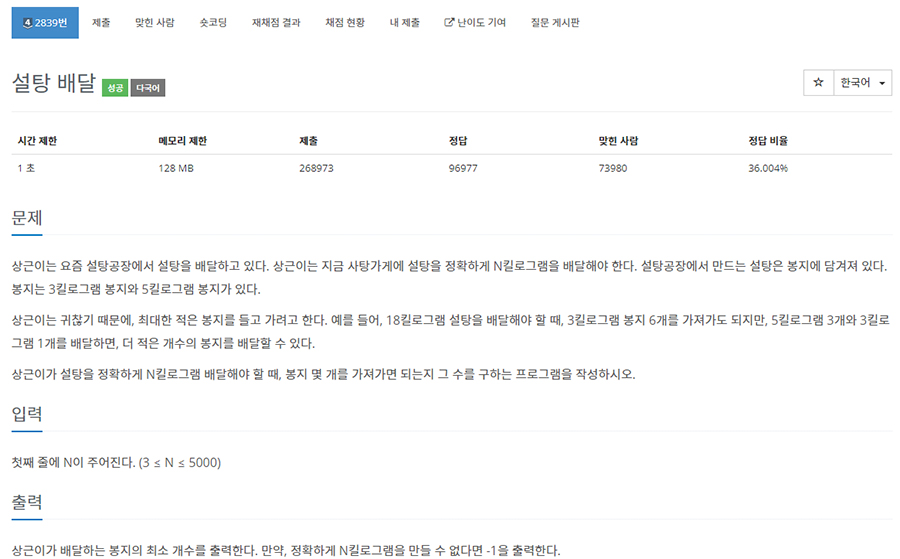

# 문제


- 플랫폼 : 백준
- 번호 : 02839
- 제목 : 설탕 배달
- 난이도 : Silver 4
- 상근이가 배달하는 봉지의 최소 개수를 출력
- 문제 : <a href="https://www.acmicpc.net/problem/2839" target="_blank">링크</a>

---

# 필요 지식
- 그리디 알고리즘 : 가능한 많은 5kg 봉지로 포장하고, 나머지는 3kg로 포장하도록 하는 것이 이득이다.

---

# 풀이
```python
n = int(input())

a, b = divmod(n, 5)
answer = -1
if b == 0:
    answer = a
elif b == 1 and a >= 1:
    answer = a + 1
elif b == 2 and a >= 2:
    answer = a + 2
elif b == 3:
    answer = a + 1
elif b == 4 and a >= 1:
    answer = a + 2
print(answer)
```
- 가능한 많은 5kg 봉지로 포장하기 위해, 5로 나누고 나머지 0,1,2,3,4을 기준으로 판단하면 된다.
- 나머지가 있으면, 5kg 봉지를 덜 쓰고 남은 차분을 3kg로 포장할 수 있다면 포장하면 된다.
- 하지만 5kg 봉지가 충분히 없는 상황에서는 포장할 수 없을 것이다.

---

# 결과


단순히 조건문으로 판단하고 답을 구하는 문제이기 때문에 40ms 정도 밖에 소요되지 않는다.

---
