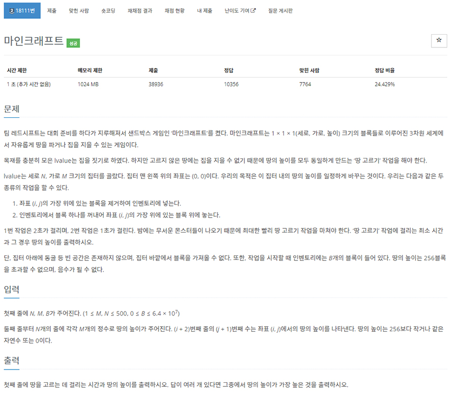

# 문제


- 플랫폼 : 백준
- 번호 : 18111
- 제목 : 마인크래프트
- 난이도 : Silver 2
- 땅을 고르는 데 걸리는 시간과 땅의 높이를 출력하라. 답이 여러 개 있다면 그중에서 땅의 높이가 가장 높은 것을 출력
- 문제 : <a href="https://www.acmicpc.net/problem/18111" target="_blank">링크</a>

---

# 필요 알고리즘
- 구현
- 브루트 포스

---

# 풀이
```python
import sys

src = sys.stdin.buffer


def main():
    n, m, b = map(int, src.readline().split())
    counter = [0] * 257 # 높이 분포

    min_range = 257 # 최소 높이
    max_range = -1 # 최대 높이
    for line in src.read().rstrip().splitlines():
        for ch in line.split():
            value = int(ch)
            counter[value] += 1
            if min_range > value:
                min_range = value
            if max_range < value:
                max_range = value
    height = -1
    min_t = (max_range * n * m) * 2
    for standard in range(max_range, min_range - 1, -1): # standard
        up = 0 # 각 높이별 인벤토리에서 가져와야 하는 블록의 합
        rm = 0 # 각 높이별 제거할 블록의 합
        for h in range(max_range, min_range - 1, -1): # 높은 높이부터 반복
            if not counter[h]: # 해당 높이를 가진 위치가 없으면 따지지 않음
                continue
            block = (standard - h) * counter[h] # 각 위치별 추가적으로 쌓아야하는 블록의 갯수
            if block > 0:
                up += block # 추가적으로 해당 block만큼 인벤토리에서 가져와야 한다.
            elif block < 0:
                rm += -block # 해당 높이에서 block만큼을 인벤토리로 옮겨야 한다.
        if b + rm >= up: # 인벤토리와, rm으로 모아둔 블록은 꺼내야하는 블록량보다 같거나 많아야 한다. 
            t = up + rm * 2
            if t < min_t:
                min_t = t
                height = standard
    print(min_t, height)


main()
```
- 중요한건 지도의 모양이 아니라 지도에 위치한 높이들의 분포이다. 그래서, 입력 받는 족족 높이들을 카운팅한다.
- 우리는 높이를 균등화해야한다. 기준 높이를 정하고, 그 기준 높이에 맞게 각 위치의 높이를 높이거나 낮춰야한다.
  - 기준 높이보다 높은 경우, 인벤토리에 블록들을 전부 옮겨야한다.
  - 기준 높이보다 낮은 경우 인벤토리에서 블록을 가져와야한다.
  - 인벤토리에 모이는 블록과 가져와지는 블록의 차를 비교하여 인벤토리의 블록량이 음수가 되면 안 된다.
- 각 기준 높이별로 시간이 얼마나 걸리는 지 계산해 보고, 최소 시간, 그 때의 높이를 갱신한다. 처음 한 번만 갱신하고, 그 이후 같은 시간이 나올 경우 
높이를 갱신하지 않는다.(높은 높이부터 반복하기 때문)

---

# 결과


---
