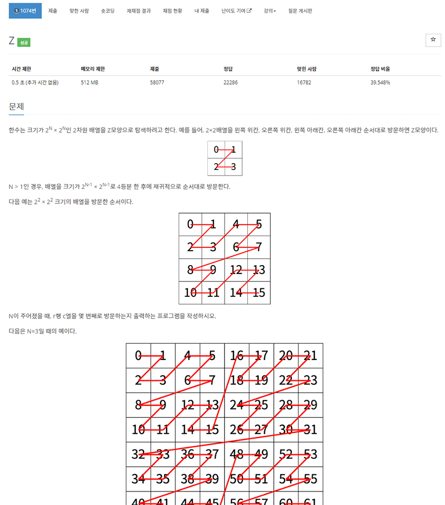

# 문제


- 플랫폼 : 백준
- 번호 : 01074
- 제목 : Z
- 난이도 : Silver 1
- N이 주어졌을 때, r행 c열을 몇 번째로 방문하는지 출력
- 문제 : <a href="https://www.acmicpc.net/problem/1074" target="_blank">링크</a>

---

# 필요 알고리즘
- 분할 정복

---

# 풀이

## 삽질
```python
n = 0
r = 0
c = 0
find = False
count = -1


def main():
    global n, r, c
    n, r, c = map(int, input().split())
    divide_and_conquer(0, 0, 2 ** n)
    print(count)


def divide_and_conquer(start_r, start_c, length):
    global count, find
    if find:
        return
    if length == 1:
        count += 1
        if start_r == r and start_c == c:
            find = True
        return
    next_length = length >> 1
    for i in range(start_r, start_r + next_length + 1, next_length):
        for j in range(start_c, start_c + next_length + 1, next_length):
            divide_and_conquer(i, j, next_length)


main()
```
- 4개 영역으로 쪼개고, 각 영역을 재귀적으로 탐색한다.
- 재귀 종료 조건은 길이가 1이 될 때이고 하나하나 방문하면서 count를 쭈르륵 1씩 증가시켜 나가는 방식인데 시간 초과가 난다.

## 개선
```python
#  생략

def divide_and_conquer(row, column, length):
    global find, count
    next_length = length >> 1
    for i in range(row, row + next_length + 1, next_length):
        for j in range(column, column + next_length + 1, next_length):
            if find:
                return
            if i <= r < i+next_length and j <= c < j + next_length:
                if next_length == 1:
                    find = True
                    count += 1
                    return
                divide_and_conquer(i, j, next_length)
            else:
                count += next_length ** 2

```
- 4개 영역으로 쪼개는 것은 아까와 같은데 쪼갠 영역 안에 찾고자 하는 r행 c열의 존재 여부를 확인한다.
  - 찾지 못 했다면 해당 영역 갯수만큼 count를 증가한다.(해당 영역을 재귀 호출하여 탐색하지 않고 그냥 바로 통채로 카운트 증가 시켜 버리는 것이다.)
- 찾았다면 찾음 처리(find 플래그 사용) 후, count 증가한 뒤, return한다.

---

# 결과


- 첫번째, 길이가 1이 될때까지 재귀적으로 탐색하는 방식은 시간 초과가 발생한다.
- 두번째, 4분할 하고 찾고자 하는 영역이 속하지 않는 영역은 영역에 속한 칸의 갯수만큼 카운트하여 스킵하는 방식은 40ms 정도 소요된다.

---
