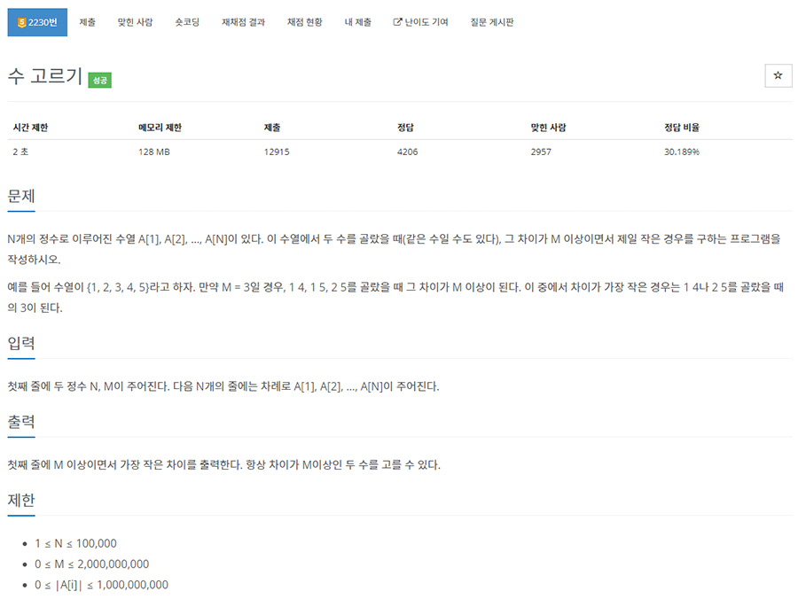

# 문제


- 플랫폼 : 백준
- 번호 : 02230
- 제목 : 수 고르기
- 난이도 : Gold 5
- 차이가 M이상인 두 수들의 차 중 가장 작은 차이를 출력
- 문제 : <a href="https://www.acmicpc.net/problem/2230" target="_blank">링크</a>

---

# 필요 지식
- 이분탐색
- 투 포인터

---

# 풀이

## 입출력
```python
import sys

src = sys.stdin.buffer

def main():
    _, m = map(int, src.readline().split())
    nums = sorted(set(int(x) for x in src.read().splitlines()))
    print(solution(nums, m))

main()
```
- 첫 줄 읽기는 `sys.stdin.buffer.readline()`
- 나머지 줄 읽기는 `sys.stdin.buffer.read().splitlines()`를 사용하였다.
- 이렇게 구한 값들을 int로 변환하고, set으로 중복을 제거한 뒤 정렬된 리스트로 받았다.
- 그 후 solution 함수(아래에서 할 풀이들)에 nums, m을 전달해 답을 구하고 출력한다.


## 풀이1 : 브루트 포스 => O(N^2) => 시간 초과
```python
def solution(nums, m):
    answer = nums[-1] - nums[0]
    for i in range(len(nums)):
        for j in range(i, len(nums)):
            diff = nums[j] - nums[i]
            if diff == m:
                return m
            elif diff > m:
                if answer > diff:
                    answer = diff
    return answer
```
- answer는 문제에서 구하려는 조건을 만족하는 최소 차다.
- diff는 두 수의 차다.
- 정말 순수하게, 모든 조합(중복 허용)을 따져가면서 차를 비교해보고 조건을 만족하는 최소 차를 갱신하는 방식이다.
- 시간 복잡도는 O(N^2)인데, 이 문제의 입력은 무려 10만개이다. 시간 초과가 날 수밖에 없다.


## 풀이2 : 이분 탐색 => O(N logN)
```python
def solution(nums, m):
    answer = nums[-1] - nums[0]
    for i in range(len(nums)):
        lt = i
        rt = len(nums) - 1
        while lt <= rt:
            mid = (lt + rt) // 2
            diff = nums[mid] - nums[i]
            if diff == m:
                return m
            elif diff > m:
                if answer > diff:
                    answer = diff
                rt = mid - 1
            else:
                lt = mid + 1
    return answer
```
- diff는 두 수의 차다.
- answer는 조건을 만족하는 최소 차다.
- 작은 숫자를 정해두고, 그 뒤의 큰 숫자는 이분 탐색을 통해 찾아가는 방식이다.
- 숫자는 N개, 각각마다 이분 탐색(log N)을 하므로 시간 복잡도는 O(N logN) 정도 된다.


## 풀이3: 투 포인터 => O(N)
```python
def solution(nums, m):
    answer = nums[-1] - nums[0]
    lt = 0
    rt = 0

    while rt < len(nums):
        diff = nums[rt] - nums[lt]
        if diff == m:
            return m
        elif diff > m:
            if answer > diff:
                answer = diff
            lt += 1
        else:
            rt += 1
    return answer
```
- 두 개의 포인터를 이용해 조건을 만족하는 두 숫자를 탐색하는 방식이다.
- 앞의 숫자 인덱스는 lt, 뒤의 숫자 인덱스는 rt로 잡는다.
- answer는 조건을 만족하는 최소 차다.
- 큰 수, 작은 수의 차를 구하고 m과 비교하여
  - m과 같으면 바로 m을 반환한다.
  - m보다 크면 기존의 최소 차와 비교하여 최솟값을 갱신하고, lt를 증가시킨다.
  (rt를 더 늘려봐야 기존 diff보다 커질 뿐이고, lt를 증가시킴으로서 두 차를 좁혀보는 것이다.)
  - m보다 작으면 차를 늘리기 위해 rt를 증가시킨다.
- 이렇게 구해진 answer를 반환한다.

---

# 결과


- 풀이1은 시간 초과
- 풀이2(이분 탐색)의 경우 120ms 소요된다.
- 풀이3(투 포인터)의 경우 92ms 소요된다.

---
