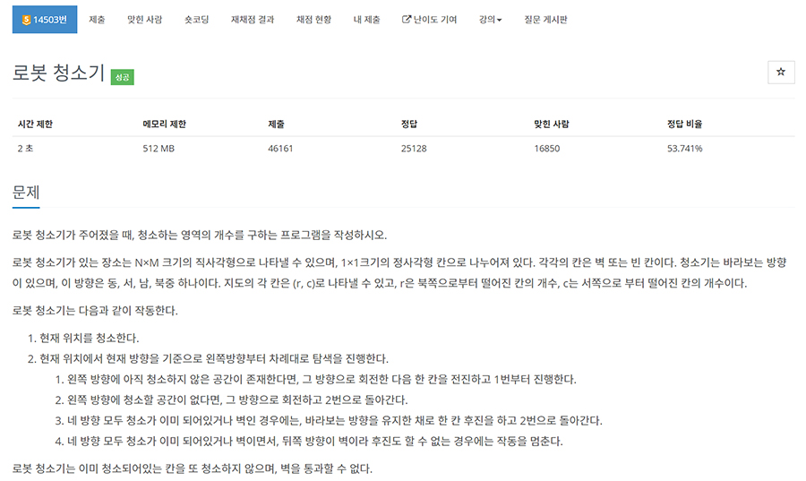
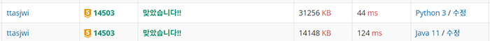

# 문제


- 플랫폼 : 백준
- 번호 : 14503
- 제목 : 로봇 청소기
- 난이도 : Gold 5
- 로봇 청소기가 청소하는 칸의 개수를 출력
- 문제 : <a href="https://www.acmicpc.net/problem/14503" target="_blank">링크</a>

---

# 필요 지식
- 주기성과 나머지 : 무언가 주기적으로 반복되면, 배열의 요소를 순환하면서 반복하는 경우가 많은데 이 경우 순환 과정에서 인덱스를 벗어나게
되는 경우가 많다. 이런 상황에서는 나머지 연산을 사용하면 편리하다.
- 이 문제는 방향 배열을 사용하면 편리한 문제다. 방향 배열의 순서도 아무렇게 두기보다, 문제에서 주어진 조건에 맞게
시계 또는 반시계 방향으로 배치하면 편리하다. 문제에서는 북동남서 순으로 0,1,2,3을 제시해줬는데 이는 시계방향이다. 왼쪽 방향으로 순서대로
바라보므로 반시계 방향으로 순회할 때는 0, -1, -2, -3, ...(인덱스를 벗어나는데 이를 위에서 설명한 나머지 연산을 활용하면 편리하다.)
순으로 순회하면 된다.

---

# 풀이
```python
import sys

input = sys.stdin.readline
directions = [(-1, 0), (0, 1), (1, 0), (0, -1)]

n, m = map(int, input().split())
r, c, d = map(int, input().split())
board = [list(map(int, input().split())) for _ in range(n)]
answer = 0
while True:
    if board[r][c] == 0:
        board[r][c] = 2
        answer += 1
    cnt = 4
    nd = d
    while cnt > 0:
        nd = (nd - 1) % 4
        nr, nc = r + directions[nd][0], c + directions[nd][1]
        if (0 <= nr < n) and (0 <= nc < m) and board[nr][nc] == 0:
            r, c, d = nr, nc, nd
            break
        cnt -= 1
    if cnt == 0:
        nd = (d - 2) % 4
        nr, nc = r + directions[nd][0], c + directions[nd][1]
        if (0 <= nr < n) and (0 <= nc < m) and board[nr][nc] != 1:
            r, c = nr, nc
        else:
            break
print(answer, end='')
```
- 입력을 초기화한다.
- 문제에서 주어진 상황대로 무한 반복을 한다.
  - 우선 현재 위치의 값이 0이면, 값을 2로 바꾸고(청소 체크) answer를 증가시킨다.
  - nd라는 변수를 통해 다음에 이동할 방향을 결정한다.
  - cnt를 4로 잡고, cnt를 감소하면서 다음을 반복한다.
    - 이동방향인 nd를 -1 시키고 4로 나눈 나머지로 바꾼다.(파이썬에서는 -1로 처리해도 되는데 자바에서는 +3 해야한다.)
    - nr, nc는 다음에 이동할 행, 열이다. nr, nc가 인덱스 범위 안에 있고, 해당 위치의 값이 0인지 체크한다.
    - 해당 위치의 값이 0이면 r,c,d를 갱신한다.
    - 그렇지 않을 경우 cnt를 증가하고 다음 반복을 수행한다.
  - cnt가 0이 되면 사방을 모두 확인한 상황이라는 것이다. nd를 (d-2)%4 로 지정한다. 이는 뒷방향을 의미한다.
  - nr, nc 는 nd쪽(뒷쪽)으로 이동한 위치의 좌표이다. 좌표가 유효하고 1(벽)이 아니면 r,c를 nr,nc로 갱신한다.
  - 여기서 유효하지 않다면 더 이상 청소할 수 없으므로 반복을 탈출한다.
- 이렇게 집계한 answer를 반환한다.

---

# 결과



- python으로는 44ms가 나온다.
- 같은 방식으로 java도 풀 수 있는데, java11 기준으로 2023년 02월 07일 기준 속도 1위이다. (~~입출력빨~~)

---
