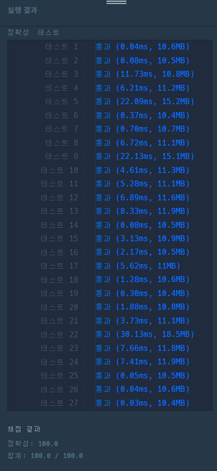

# 문제


- 플랫폼 : 프로그래머스
- 번호 : 042889
- 제목 : 실패율 (2019 KAKAO BLIND RECRUITMENT 출제)
- 난이도 : Level 1
- 전체 스테이지의 개수 N, 게임을 이용하는 사용자가 현재 멈춰있는 스테이지의 번호가 담긴 배열 stages가 매개변수로 주어질 때,
실패율이 높은 스테이지부터 내림차순으로 스테이지의 번호가 담겨있는 배열을 return 하도록 solution 함수를 완성
- 문제 : <a href="https://school.programmers.co.kr/learn/courses/30/lessons/1845" target="_blank">링크</a>

---

# 필요 지식
- Counter 사용
- 정렬

---

# 풀이
```python
from collections import Counter
from typing import List


def solution(n: int, stages: List[int]):
    results = [[i, 0, 0] for i in range(0, n + 2)]

    for key, count in Counter(stages).items():
        results[key][1] += count
        for before in range(1, key + 1):
            results[before][2] += count

    return list(map(lambda x: x[0], sorted(results[1:-1], key=lambda x: (-x[1] / x[2] if x[2] != 0 else 0, x[0]))))
```
- 0번(없지만 편의상 삽입), 1번, 2번, ..., n+1번 스테이지의 상태를 기록하는 results 배열 정의
  - 각 인덱스에는 배열이 하나 담긴다.
  - 0번 인덱스 : 스테이지 번호
  - 1번 인덱스 : 잔류자 수
  - 2번 인덱스 : 도달자 수
- Counter를 통해 스테이지별 각 잔류자 수를 맵으로 얻어온다.
- 잔류자 수만큼 results의 해당 스테이지 잔류자 수를 증가시키고, 그 이전 스테이지들에 도달자 수를 누적한다.
- results를 실패율로 내림차순 정렬한다. 이 때 도달자 수가 0이면 실패율을 0으로 취급하고, 같다면 스테이지 번호 순으로 오름차순 정렬한다.
(이 부분이 이 문제에서 좀 까다로웠던 것 같다.)
- 정렬 결과를 각 스테이지 번호로 변경해주고, 리스트로 반환한다.

---

# 결과


- 0.03ms ~ 30.13ms 소요

---
